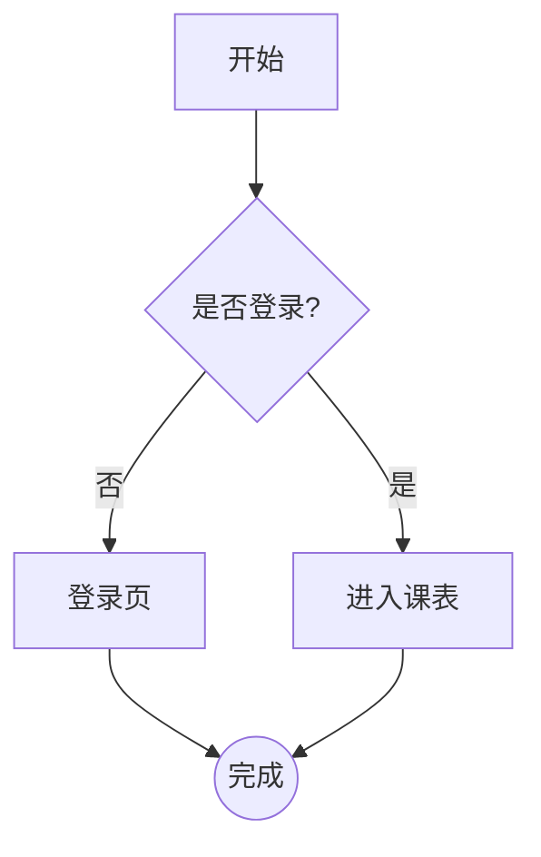
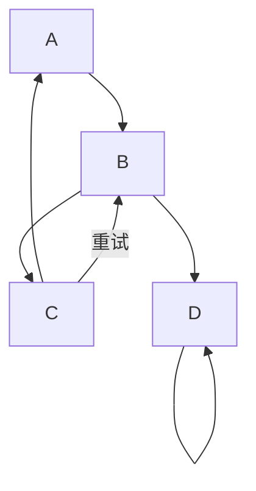
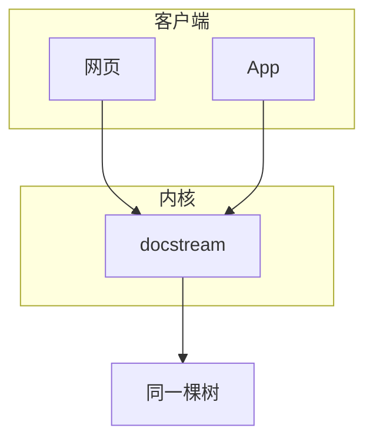
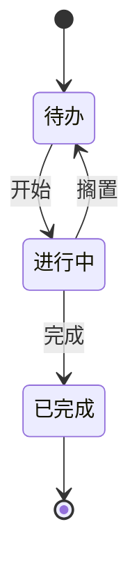
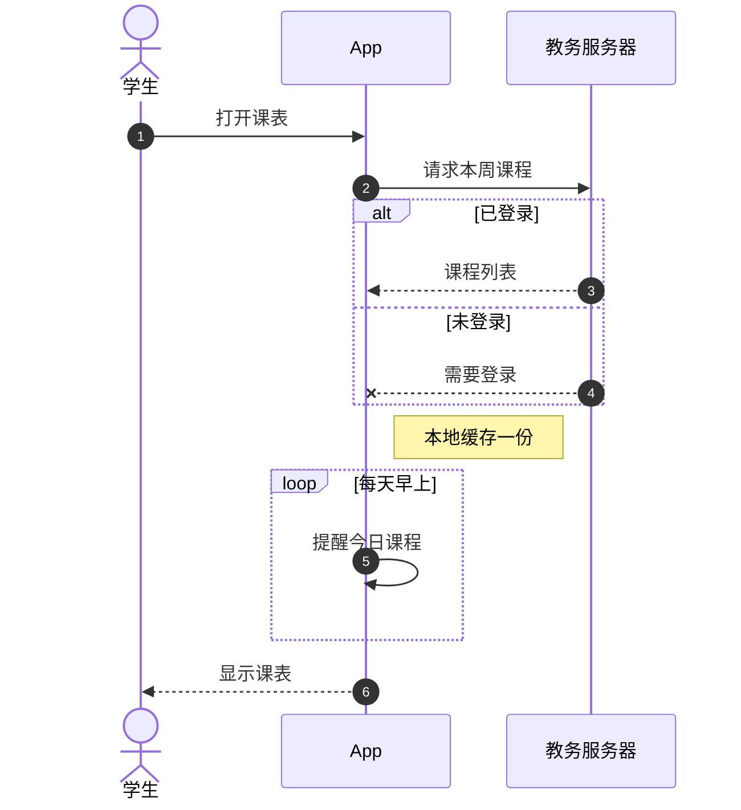
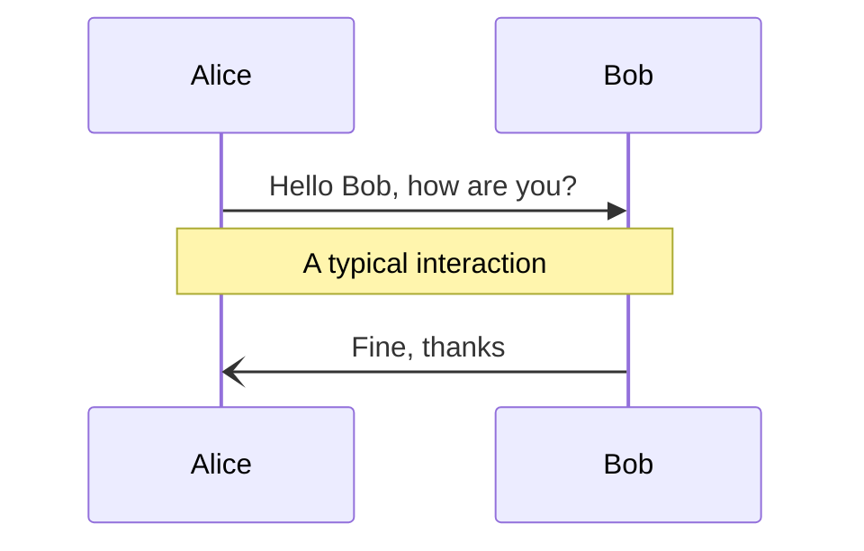

# Diagram cases

```mermaid
flowchart TD
    A[开始] --> B{是否登录?}
    B -->|是| C[进入课表]
    B -->|否| D[登录页]
    D --> E((完成))
    C --> E
```

```mermaid
graph LR
    input([用户输入]) --> parse[解析时间] --> plan[[安排计划]]
    parse -.-> err>出错提示]
    plan ==> db[(本地存储)]
    db --- sync{{云同步}}
```

```mermaid
flowchart TD
    A --> B --> C --> A
    B --> D
    C -- 重试 --> B
    D --> D
```

```mermaid
flowchart TB
    subgraph 客户端
        web[网页] & app[App]
    end
    subgraph 内核
        k[docstream]
    end
    web --> k
    app --> k
    k --> out[同一棵树]
```

```mermaid
stateDiagram-v2
    [*] --> 待办
    待办 --> 进行中 : 开始
    进行中 --> 已完成 : 完成
    进行中 --> 待办 : 搁置
    已完成 --> [*]
```

```mermaid
sequenceDiagram
    autonumber
    actor 学生
    participant App
    participant 服务器 as 教务服务器
    学生->>App: 打开课表
    App->>服务器: 请求本周课程
    alt 已登录
        服务器-->>App: 课程列表
    else 未登录
        服务器--xApp: 需要登录
    end
    Note right of App: 本地缓存一份
    loop 每天早上
        App->>App: 提醒今日课程
    end
    App-->>学生: 显示课表
```

```mermaid
sequenceDiagram
    Alice->>Bob: Hello Bob, how are you?
    Note over Alice,Bob: A typical interaction
    Bob-)Alice: Fine, thanks
```
